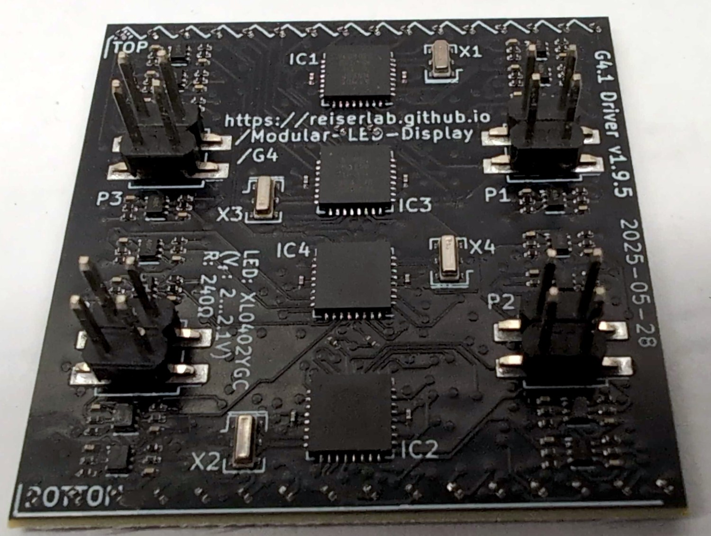

1. TOC
{:toc}

# Driver PCB

If you are looking for a single color driver PCB, **we recommend ordering [v1.9](#driver-v1p9)**. We use those across arenas connected via NI Controller ("G4", 12-12 v1…v6) as well as the Teensy-based version ("G4.1", 12-12 v7+). We have an experimental two-color version named Driver-v2.0 which worked in a few setups, but they are not as thoroughly tested. Consider yourself warned and please [get in contact]({{site.baseurl}}/Contact) to discuss details of your requirements.

All versions of the driver board measures 40×40mm² and has four 4×4 male pins (≥v0.2) or two 2×6 female sockets (v0.1) on the bottom side. The top of the driver board is either covered in LEDs (≥v1.0) or has connectors for off-the-shelf LED matrices. [Version 2](#driver-v2) makes the use of different colors easier but is functionally very similar to [version 1](#driver-v1).

Historically, the driver used four off-the-shelf LED panels, one for each quadrant (≤v0.3). Since then, each of the four quadrants has its own microcontroller unit (MCU) that controls a matrix of 8×8 LEDs. The panels with two 2×6 connectors use I²C for communication between the comm and driver boards; starting with version v0.2, SPI has been used for this internal communication. The MCUs translate brightness commands for individual pixels into pulse-width modulation (PWM) signals for the LEDs.

{:standalone .ifr .clear data-img-class="pop"}

The difference between driver-v2 and driver-v1 is the internal wiring of individual columns. The image on the right shows the LEDs on a driver board with an overlay indicating how they are connected. The cyan and magenta lines show which LEDs belong to a single column in driver-v2.x, while the yellow lines on the right show the connections in driver-v1.x. Currently, we only share the design files for driver-v1.x.

If you intend to use single-color drivers, we recommend driver-v1 as they are slightly easier to debug at the hardware level, should that be necessary. We have not yet shared the driver-v2 designs, but please [contact us]({{site.baseurl}}/Contact) if you would like to obtain them.

## Panel Driver PCB v2.x (40mm) {#driver-v2}

{:standalone .ifr .clear data-img-class="pop"}

Driver boards ≥v2.0 are PCBs measuring 40×40mm² with the same connectors as driver-v1.x. The most visible difference is in the location of the MCUs: in version 2.x, the four square ATmega328 chips are positioned in a straight line. The key functional difference is in how the LEDs are connected: the first LED from the first row is connected to the second LED in the second row, then the first in the third row, the second in the fourth row, and so on. Essentially, two neighboring columns are interleaved. This arrangement increases the color resolution for multi-color displays, especially those with two colors. In most LED matrices, individual LEDs are addressed by simultaneously activating a specific row and column circuit. The LED at the intersection of the activated row and column then lights up. Either the row or column must provide a current-limiting resistor that is specific to the type of LED being used.

For the G4 drivers, a column of eight LEDs within a quadrant shares a single resistor. This means all LEDs in a column must be of the same type. If you want to use different colored LEDs, they must be organized by columns with their corresponding resistors. For a bi-color panel where electrical columns correspond to physical columns, even columns would have color *A* and odd columns would have color *B*. A moving bar of color *A* would therefore jump from column 1 to 3 to 5, skipping the columns with the different color. By interleaving the colors in a checkerboard layout, a moving bar of color *A* can move at higher resolution from column 1 to 2 to 3 and so on. This comes at the cost of spatial density, so driver-v1.x and driver-v2.x are suited for different use cases.

Functionally, driver-v2.x is very similar to driver-v1.x. During visual pattern creation, a [configuration option must be set]({{site.baseurl}}/Generation%204/Display_Tools/docs/pattern-generator.html#checkerboard); otherwise, everything is the same for setting up and running an arena with either driver-v1.x or driver-v2.x. However, due to this wiring difference, mixing different driver board versions in the same arena is currently not supported.

## Panel Driver PCB v1.9 (40mm) {#driver-v1p9}

{:standalone .ifr .clear data-img-class="pop"}

The Driver board v1.9 is a PCB measuring 40×40mm² and the most stable and tested version of the PCBs. It combines all the learnings from Driver v1.2…v1.8 into one reliable design. The [schematic]({{site.baseurl}}/Generation%204/Panel/docs/driver_40mm_atmega_v1.9_schematic.pdf) is similar to the earlier versions, but note the difference how the LEDs are drained through the MOSFET and additional capacitors. 

These drivers v1.9 are direct drop-in replacements for existing single-colored panels (v1.2…v1.8). This is also the reason, they received a version number starting with 1, although developed much later than the v2 series. Most likely this is the last iteration for the G4 driver panels to be developed.

Confusingly, the ATmega328 chips are mounted more similar to the v2 series than to the v1 series. It should still be easy to distinguish this version, as all v1.9 boards have their version number printed on the PCB (v.1.9.5 for the example picture). Furthermore, there are fewer MOSFET chips (the smaller rectangulars) and they are arranged in a different alignment (vertical line between top and bottom connectors, not horizontal).

This version of the driver board was designed by Will Dickson at [IO Rodeo](https://iorodeo.com/).

## Panel Driver PCB v1.x (40mm) {#driver-v1}

{:standalone .ifr .clear data-img-class="pop"}

Driver boards ≥v1.2 are 6-layer PCBs measuring 40×40mm². Note the different positioning of the MCUs, which makes this version easily distinguishable from driver-v2.x. The most recent production files are archived in `driver_40mm_atmega_v1/production_v1/driver-v1p8.zip`, with a changelog available in the `driver_40mm_atmega_v1/production_v1/README.mdown` file.

The Panel Driver PCBs are built from 6 layers. The BOTTOM layer contains all LEDs, followed by a GND layer, two logic layers, a power layer, and the TOP layer for electronic components such as the MCUs and connectors. All components are surface-mount devices (SMD), with the smallest components measuring 0402 (imperial) or 1005 (metric). Therefore, factory assembly is recommended.

### Function

This paragraph provides a high-level description of what is detailed in the [schematics](assets/driver_40mm_atmega_v1_schematic.pdf). The driver PCB receives signals through four connectors (J1–J4), one for each quadrant. Each quadrant uses an ATmega328P-MU (U1–U4) to control the LEDs (D1–D256). The LEDs in each of the four quadrants are organized in an 8×8 matrix. The ATmega MCUs use a row-scan algorithm, where only a single row is active at any given time. Within this active row, any of the 8 LEDs can be turned on or off. Brightness is regulated through pulse-width modulation. Each column uses its own resistor; therefore, LEDs of different colors can be used in each column.

### Design

Note that the second-to-bottom layer is a ground layer. This design choice was intended to reduce electrical noise for electrophysiology experiments. We have not yet quantified its effectiveness, but we wanted to highlight this less obvious design decision.

The driver board was designed in-house by Janelia's [jET](https://www.janelia.org/support-team/janelia-experimental-technology) group. The [OrCAD](https://www.orcad.com/) EDA source files are provided for reference, although the latest production files may not always correspond to the design file version.

# Historic designs

{:.ifr .pop}

{:standalone .ifr .clear data-img-class="pop"}

These designs are preserved for historical reference and for debugging existing systems. If you already have one of these boards, you likely know what to do and simply need the design files. If you are building a new system, do not use these versions. You can find the designs for these older drivers in the same repository as the [comm board]({{site.baseurl}}/Generation%204/Hardware/docs/comm.html).

Earlier versions of the driver were designed for off-the-shelf LED matrices. These were historically used in Generation 3 LED arenas and earlier generations. The latest version designed for off-the-shelf LED matrices, which accommodates four 20×20mm² components, is driver v0.4, located at `driver_40mm_atmega_v0p4/production_v0`.

The differences between the historic versions (except [v0.1](#driver-v0p1)) are minimal and can be documented if necessary. In general, they should be compatible across design iterations. Please [contact us]({{site.baseurl}}/Contact) if you need further information.

## Panel Driver v0.5 (40mm, WIP) {#driver-v0p5}

{:.ifr .pop}

{:standalone .ifr .clear data-img-class="pop"}

Version 0.5 was the first attempt to build a driver with a custom LED matrix instead of pre-fabricated 20×20mm² LED matrices. This project was never completed as it was being transitioned from IO Rodeo to jET at the time, but the work-in-progress files are archived at `driver_40mm_atmega_v0p5`. The [schematics](assets/driver_40mm_atmega_v0p5_schematic.pdf) are very similar to previous versions, replacing the pre-fabricated LED matrices with a custom grid of rows and columns.

## Panel Driver v0.4 (40mm) {#driver-v0p4}

{:.ifr .pop}

{:standalone .ifr .clear data-img-class="pop"}

This is the latest version of the driver designed for pre-fabricated LED matrices.

Find the KiCad design files at `driver_40mm_atmega_v0p4` and have a look at the [schematics](assets/driver_40mm_atmega_v0p4_schematic.pdf).

## Panel Driver v0.3 (40mm) {#driver-v0p3}

{:.ifr .pop}

{:standalone .ifr .clear data-img-class="pop"}

Find the KiCad design files at `driver_40mm_atmega_v0p3` and have a look at the [schematics](assets/driver_40mm_atmega_v0p3_schematic.pdf).

## Panel Driver v0.2 (40mm) {#driver-v0p2}

{:.ifr .pop}

{:standalone .ifr .clear data-img-class="pop"}

Find the KiCad design files at `driver_40mm_atmega_v0p1` and have a look at the [schematics](assets/driver_40mm_atmega_v0p2_schematic.pdf).

## Panel Driver v0.1 (40mm) {#driver-v0p1}

{:.ifr .pop}

{:standalone .ifr .clear data-img-class="pop"}

The first driver with an ATmega MCU used I²C for communication between the controller and arena. It is not compatible with later versions.

Find the KiCad design files at `driver_40mm_atmega_v0p1` and have a look at the [schematics](assets/driver_40mm_atmega_v0p1_schematic.pdf).

## Panel Driver v0.2 (32mm, WIP) {#driver-32-v0p2}

{:.ifr .pop}

{:standalone .ifr .clear data-img-class="pop"}

The 32mm driver v0.2 was designed in 2012. Compared to [version 0.1](#driver-32-v0p1), it uses MOSFETs. The [schematics](assets/driver_32mm_atmega_v0p2_schematic.pdf) have already been updated, but the board layout itself has not been completed yet. Find the KiCad design files at `driver_32mm_atmega_v0p2`.

## Panel Driver v0.1 (32mm) {#driver-32-v0p1}

{:.ifr .pop}
{:standalone .ifr .clear data-img-class="pop"}

The 32mm driver v0.1 was designed in 2012 and is essentially the same as the Generation 2 panel. Find the KiCad design files at `driver_32mm_atmega_v0p1` and review the [schematics](assets/driver_32mm_atmega_v0p1_schematic.pdf).

## Panel Driver MAX6960 v0.1 (32mm)

{:.ifr .pop}

{:standalone .ifr .clear data-img-class="pop"}

{:.ifr .pop .clear}

{:standalone .ifr .clear data-img-class="pop"}

In 2013, there was an attempt to build 32mm drivers using the MAX6960, a "4-wire serially interfaced 8×8 matrix graphics LED driver" chip by Maxim Integrated. Review the [schematics](assets/driver_32mm_max6960_v0p1_schematic.pdf) and find the design files at `driver_32mm_max6960_v0`.

In addition to the driver, this setup required an adapter PCB mounted on the back of the LED matrix. Version 0.1 ([schematics](assets/adapter_32mm-32mm_v0p1_schematic.pdf)) and its project files are located in `driver_32mm_max6960_v0/adapter_32mm-32mm_v0`.

## Panel Driver MAX6960 v0.1 (40mm)

{:.ifr .pop}

{:standalone .ifr .clear data-img-class="pop"}

{:.ifr .pop .clear}

{:standalone .ifr .clear data-img-class="pop"}

{:.ifr .pop .clear}

{:standalone .ifr .clear data-img-class="pop"}

In 2013, there was an attempt to build 40mm drivers using the MAX6960, a "4-wire serially interfaced 8×8 matrix graphics LED driver" chip by Maxim Integrated. Review the [schematics](assets/driver_40mm_max6960_v0p1_schematic.pdf) and find the design files at `driver_40mm_max6960_v0`.

In addition to the driver, this setup required an adapter PCB mounted on the back of the LED matrix. Version 0.1 ([schematics](assets/adapter_20mm-40mm_v0p1_schematic.pdf)) uses a 2-layer PCB; version 0.2 ([schematics](assets/adapter_20mm-40mm_v0p2_schematic.pdf)) uses a 4-layer design. The adapter project files are located in the `driver_40mm_max6960_v0/adapter_20mm-40mm_v0p1` and `driver_40mm_max6960_v0/adapter_20mm-40mm_v0p2` directories, with production files in `driver_40mm_max6960_v0/production_v0`.

## Panel Driver MAX6960 v0.1 (32×64mm²)

{:.ifr .pop}

{:standalone .ifr .clear data-img-class="pop"}

{:.ifr .pop .clear}

{:standalone .ifr .clear data-img-class="pop"}

{:.ifr .pop .clear}

{:standalone .ifr .clear data-img-class="pop"}

{:.ifr .pop .clear}

{:standalone .ifr .clear data-img-class="pop"}

There is also a 32×64mm² version of a MAX6960-driven driver that uses two pre-fabricated LED matrices, each with a 32mm footprint. The project at `driver_32-64mm_max6960_v0` includes [schematics](assets/adapter_32mm-64mm_v0p1_schematic.pdf).

The schematics for the [two-matrix adapter](assets/adapter_32-64mm-32-64mm_v0p1_schematic.pdf) are used in the design files at `driver_32-64mm_max6960_v0/adapter_32-64mm-32-64mm`, and the [one-matrix adapter](assets/adapter_32-32mm-32-64mm_v0p1_schematic.pdf) is in `driver_32-64mm_max6960_v0/adapter_32-32mm-32-64mm`. The production files are located in `driver_32-64mm_max6960_v0/production_v0/adapter_32-64mm-32-64mm_v0p1.zip` and `driver_32-64mm_max6960_v0/production_v0/adapter_32-32mm-32-64mm_v0p1.zip`, respectively. Additionally, there is an adapter variant with diodes on each signal line ([schematics](assets/adapter_32-32mm-32-64mm-D_v0p1_schematic.pdf)), available at `driver_32-64mm_max6960_v0/adapter_32-32mm-32-64mm-D` and `driver_32-64mm_max6960_v0/production_v0/adapter_32-32mm-32-64mm-D_v0p1.zip`.

## Panel Driver MAX6960 v0.1 (64mm)

{:.ifr .pop}

{:standalone .ifr .clear data-img-class="pop"}

{:.ifr .pop .clear}

{:standalone .ifr .clear data-img-class="pop"}

There is also a 64mm version of a MAX6960-driven driver that uses four pre-fabricated LED matrices, each with a 32mm footprint. The project at `driver_64mm_max6960_v0/adapter_32mm-64mm_v0p1` includes [schematics](assets/adapter_32mm-64mm_v0p1_schematic.pdf) and design files for an adapter PCB that bridges the 32mm footprint of the LED matrices to the 64mm driver. Based on the available files, this design was presumably never manufactured. Review the [schematics](assets/driver_64mm_max6960_v0p1_schematic.pdf) and find the design files at `driver_64mm_max6960_v0p1`.
